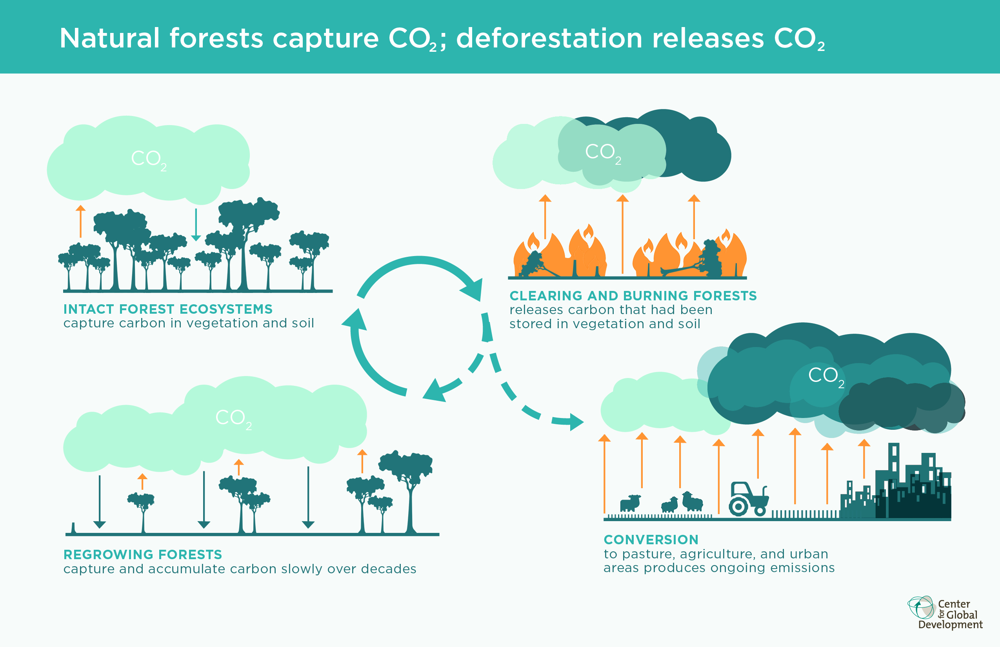
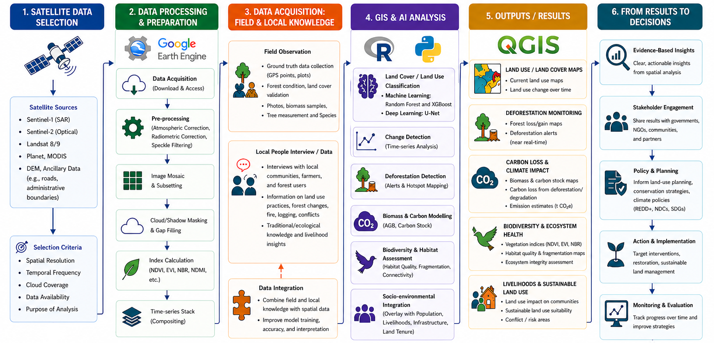

Tropical forests are one of the richest ecosystems on earth, playing an instrumental role in regulating global climate, conserving biodiversity and sustaining ecosystem services. Unfortunately, along with deforestation, forest degradation has become a major environmental challenges. Forest composition and ecological functions are changing due to selective logging, forest fires and development of built-up areas. Recent estimates indicate that degraded forests account for almost half of all tropical forest landscapes, emphasizing their increasing significance for climate change mitigation and sustainable forest management (Chave & Rutishauser, 2015).

One of the effects of forest degradation is the effect of forest and peat fires in south Sumatera, Indonesia. During the 2015 El Niño event, fires resulted in carbon losses of 94.2 Mg C ha⁻¹ in secondary peat swamp forests, equivalent to emissions of about 345.4 t CO₂eq ha⁻¹. Moreover, secondary dryland forests, forest plantations and swamp shrublands experienced significant declines in carbon stocks (Siahaan et al., 2020). These results show the role of disturbances in turning tropical forests from a long-term carbon sink into a major source of carbon emissions (Figure 1).

<figure>
  
  <figcaption>
    <strong>Figure 1.</strong> Carbon Cycle Illustration. Source: Center for Global Development, 2014.
  </figcaption>
</figure>

The tropical forest is fundamentally different from temperate or other type of forests in terms of complexity of ecology, diversity and responses to disturbances. Tropical forests have the potential to recover aboveground carbon following disturbance, but recovery of biodiversity often lags considerably behind, leading to the conservation of intact forests that are critical for ecosystem integrity (Thompson et al., 2012). In addition, the tropical landscapes are increasingly characterized by a significant imprint of human activities, which poses challenges for monitoring, restoration and sustainable management (Chave & Rutishauser, 2015).

Following the interesting topic, I found my passion on research, specifically at the intersection of geospatial science, forestry, and climate change, with particular interests in:

- Tropical forest degradation and deforestation
- Carbon stock estimation and greenhouse gas accounting
- Geospatial and AI for environmental monitoring
- Biodiversity assessment and ecosystem service
- Nature-based solutions (NbS)

The integration of remote sensing, field observation, and artificial intelligence (AI) is crucial in solving complex tropical forest management problems (A. U. Gabi and N. M. Abdullah, 2024; Liang et al., 2025). This provides the opportunity of multi-source imagery such as optical, Synthetic Aperture Radar (SAR) and light detecting and ranging (LiDAR) to map and monitor the land surfaces over a wide areas. This integrated framework is critical both for scientific discovery and for operationalizing policy-relevant frameworks such as REDD+, voluntary carbon markets (VCM), and national carbon accounting systems (J. Mascaro et al, 2014) (Figure 2).

<figure>
  
  <figcaption>
    <strong>Figure 2.</strong> GIS Workflow for AFOLU Studies. 
  </figcaption>
</figure>

## Selected References

Gabi, A. U., & Abdullah, N. M. (2024). Optimizing biodiversity conservation in Sundaland through advanced geospatial techniques and remote sensing technologies. BIO Web of Conferences. https://doi.org/10.1051/bioconf/20249407002

Liang, X., et al. (2025). Multi-source remote sensing and GIS-driven forest carbon monitoring for carbon neutrality: Integrating data, modeling, and policy applications (Preprint). https://doi.org/10.20944/preprints202505.0246.v1

Mascaro, J., et al. (2014). A tale of two "forests": Random forest machine learning aids tropical forest carbon mapping. PLOS ONE, 9(1), e85993. https://doi.org/10.1371/journal.pone.0085993

Siahaan, H., et al. (2020). Carbon loss affected by fires on various forests and land types in South Sumatera. Indonesian Journal of Forestry Research, 7(1), 15–25. https://doi.org/10.59465/ijfr.2020.7.1.15-25

Sist, P., Chave, J., & Rutishauser, E. (2015). Tropical forest degradation in the context of climate change: Increasing role and research challenges. In Our Common Future Under Climate Change (pp. 260–271).

Thompson, I. D., et al. (2012). Forest biodiversity, carbon and other ecosystem services: Relationships and impacts of deforestation and forest degradation.

